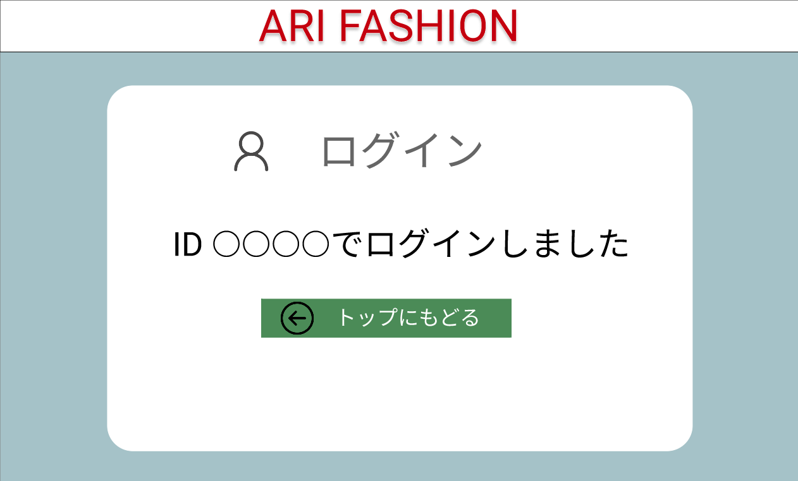

### 画面詳細図
## ログイン完了
### プロトタイプは以下のリンクの先
[プロトタイプ](https://www.figma.com/file/wfKsQG6jSkNm7XGWE2f2lQ/Untitled?node-id=5%3A48)
*****

*****
補足：対応DBの列はDB設計後、〇を対応するテーブル・カラム名に差し替えること

| ID | 要素 | 内容 | アクション | イベント | 対応DB |
|----|-----|------|----------|----------|-------|
|1   |ログイン|テキスト表示|-|-|-|
|2   |ログイン|画像表示|-|-|-|
|3   |テキスト|テキスト表示|-|-|-|
|4   |テキスト|テキスト表示|クリック|トップページへ遷移|-|
