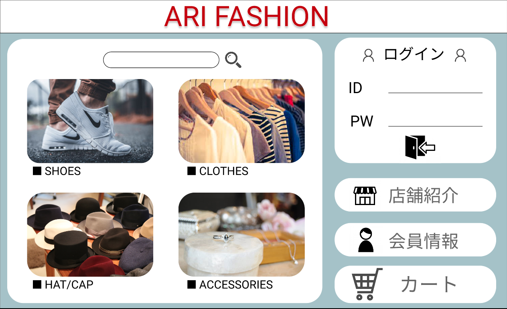

### 画面詳細図
## トップページ
### プロトタイプは以下のリンクの先
[プロトタイプ](https://www.figma.com/file/wfKsQG6jSkNm7XGWE2f2lQ/Untitled?node-id=8%3A369)
*****

*****
補足：対応DBの列はDB設計後、〇を対応するテーブル・カラム名に差し替えること

| ID | 要素 | 内容 | アクション | イベント | 対応DB |
|----|-----|------|----------|----------|-------|
|1   |SHOES|テキスト表示|クリック|商品一覧へ遷移|-|
|2   |SHOES|画像表示|クリック|商品一覧へ遷移|-|
|3   |CLOTHES|テキスト表示|クリック|商品一覧へ遷移|-|
|4   |CLOTHES|画像表示|クリック|商品一覧へ遷移|-|
|5   |HAT/CAP|テキスト表示|クリック|商品一覧へ遷移|-|
|6   |HAT/CAP|画像表示|クリック|商品一覧へ遷移|-|
|7   |ACCESSORIES|テキスト表示|クリック|商品一覧へ遷移|-|
|8   |ACCESSORIES|画像表示|クリック|商品一覧へ遷移|-|

### 共通部分  

| ID | 要素 | 内容 | アクション | イベント | 対応DB |
|----|-----|------|----------|----------|-------|
|1   |バナー|サイト名表示|-|-|-|
|2   |ログイン|テキスト表示|-|-|-|
|3   |ID|入力欄|テキスト入力|-|〇|
|4   |PW|入力欄|テキスト入力|-|〇|
|5   |ログインボタン|ボタン|クリック|ログイン処理実行|-|
|6   |商品検索|入力欄|テキスト入力|-|〇|
|7   |商品検索|ボタン|クリック|検索実行処理|〇|
|8   |店舗紹介|テキスト表示|-|-|-|
|9  |カート|画像ボタン|クリック|カートへ遷移|〇|
|10 |登録情報|画像ボタン|クリック|登録情報へ遷移|〇|
