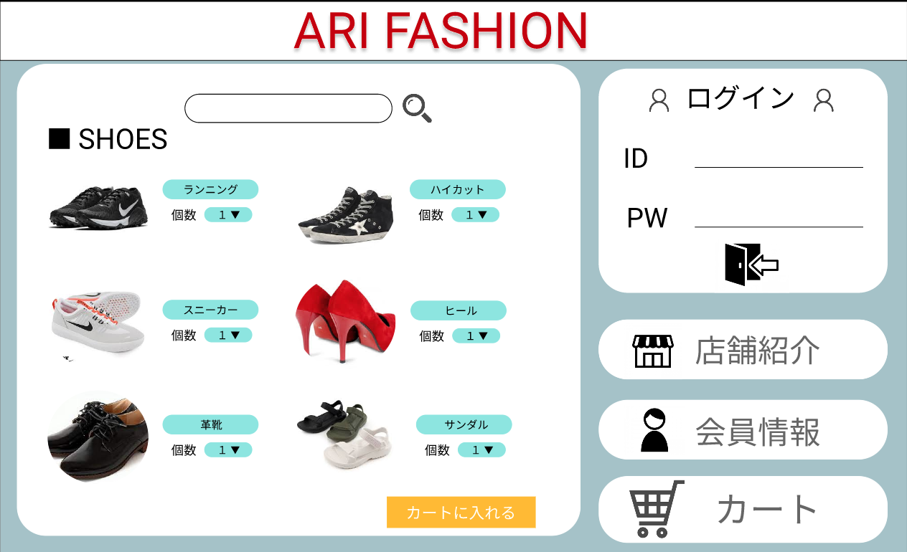
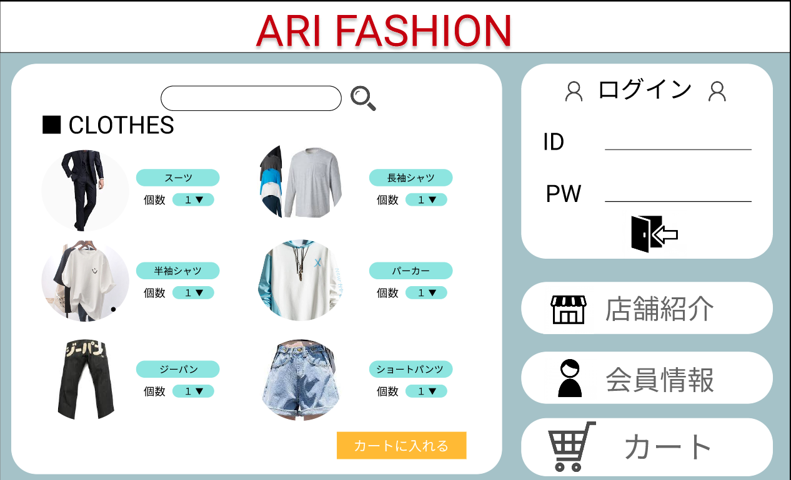
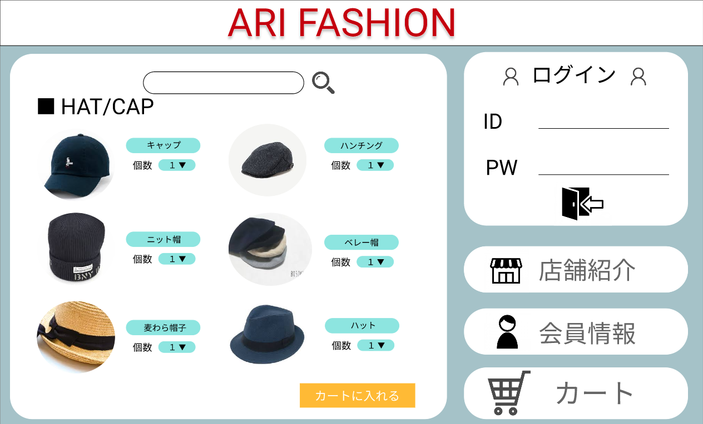
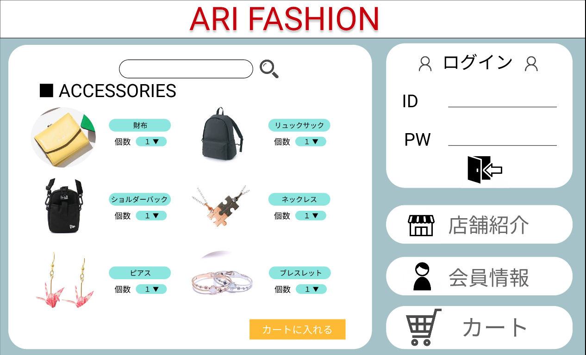

### 画面詳細図
## 商品一覧
### プロトタイプは以下のリンクの先
[プロトタイプ](https://www.figma.com/file/wfKsQG6jSkNm7XGWE2f2lQ/Untitled?node-id=5%3A48)
*****

*****
補足：対応DBの列はDB設計後、〇を対応するテーブル・カラム名に差し替えること

| ID | 要素 | 内容 | アクション | イベント | 対応DB |
|----|-----|------|----------|----------|-------|
|1   |カテゴリ|テキスト表示|-|-|-|
|2   |商品|画像表示|-|-|-|
|3   |商品名|テキスト表示|-|-|-|
|4   |個数|テキスト表示|-|-|-|
|5   |個数|セレクトボックス|選択|-|-|
|6   |カート|画像表示|クリック|カートへ商品追加|-|

### 共通部分  

| ID | 要素 | 内容 | アクション | イベント | 対応DB |
|----|-----|------|----------|----------|-------|
|1   |バナー|サイト名表示|クリック|トップページへ遷移|-|
|2   |ログイン|テキスト表示|-|-|-|
|3   |ID|入力欄|テキスト入力|-|〇|
|4   |PW|入力欄|テキスト入力|-|〇|
|5   |ログインボタン|ボタン|クリック|ログイン処理実行|-|
|6   |商品検索|入力欄|テキスト入力|-|〇|
|7   |商品検索|ボタン|クリック|検索実行処理|〇|
|8   |店舗紹介|テキスト表示|-|-|-|
|9   |カート|画像ボタン|クリック|カートへ遷移|〇|
|10  |登録情報|画像ボタン|クリック|登録情報へ遷移|〇|
